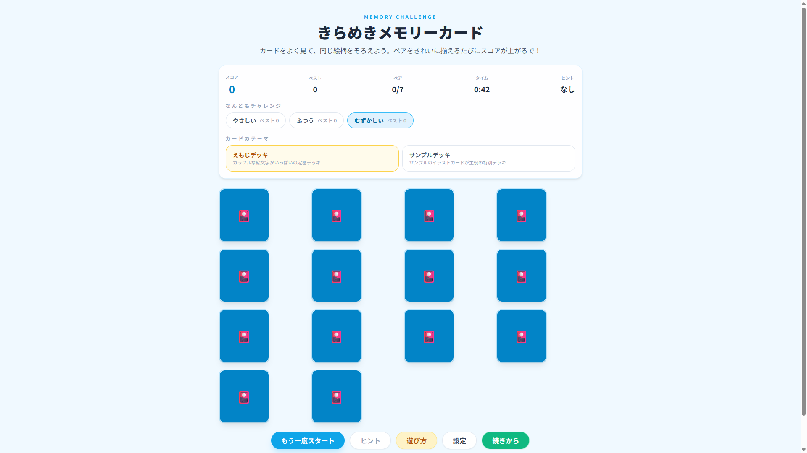

# 🎴 きらめきメモリーカード

小学5年生向けの記憶力・集中力を楽しく鍛える神経衰弱ゲーム

[](https://react.dev/)
[](https://www.typescriptlang.org/)
[](https://vitejs.dev/)
[](https://tailwindcss.com/)



## ✨ 特徴

- 🎮 **3段階の難易度**: やさしい・ふつう・むずかしい から選択可能
- 🎨 **2つのテーマ**: えもじデッキ・サンプルデッキ でビジュアルを切り替え
- ⏱️ **タイムトライアル**: 制限時間内にペアを揃えてスコアを競おう
- 💡 **ヒント機能**: やさしいモードでは全カード一時表示のヒントが使用可能
- 💾 **進行状況保存**: ブラウザを閉じても続きから再開できる
- 🏆 **最高記録保存**: 難易度別に最高スコアを記録
- 📱 **レスポンシブ対応**: スマホ・タブレット・PCで快適にプレイ
- 🔊 **効果音・BGM**: ゲームを盛り上げるサウンドエフェクト（ON/OFF切替可）

## 🎯 難易度設定

| 難易度 | ペア数 | 制限時間 | ヒント |
|--------|--------|----------|--------|
| 🟢 やさしい | 5ペア (10枚) | なし | あり（1回） |
| 🟡 ふつう | 6ペア (12枚) | 90秒 | なし |
| 🔴 むずかしい | 7ペア (14枚) | 60秒 | なし |

## 🚀 セットアップ

### 必要環境

- Node.js 18.x 以上
- npm または yarn

### インストール

```bash
# リポジトリをクローン
git clone https://github.com/takamiya1021/app027-memcard-game.git
cd app027-memcard-game/app

# 依存関係をインストール
npm install

# 開発サーバーを起動
npm run dev
```

ブラウザで `http://localhost:5173` を開いてゲームをプレイできます。

### ビルド

```bash
# 本番用ビルド
npm run build

# ビルド結果をプレビュー
npm run preview
```

## 🎮 遊び方

1. **難易度を選択**: 画面上部の難易度ボタンから選択
2. **カードをめくる**: カードをクリック/タップして2枚めくる
3. **ペアを揃える**: 同じ絵柄のカードを見つけてペア成立
4. **全ペアを揃える**: 制限時間内に全てのペアを揃えてクリア！

### スコアリング

- ✅ **ペア成立**: +30点
- ❌ **ミス**: -5点
- ⏱️ **タイムボーナス**: 残り時間に応じて追加得点

## 🛠️ 技術スタック

- **フレームワーク**: React 19.1
- **ビルドツール**: Vite 7.1
- **言語**: TypeScript 5.x
- **スタイリング**: Tailwind CSS v3
- **テスト**: Vitest + React Testing Library
- **状態管理**: React Hooks (useState, useEffect, useCallback, useMemo)
- **データ永続化**: LocalStorage

## 📂 プロジェクト構造

```
app/
├── src/
│   ├── components/         # UIコンポーネント
│   │   ├── ActionBar.tsx   # ゲーム操作ボタン
│   │   ├── CardGrid.tsx    # カードグリッド表示
│   │   ├── HUD.tsx         # スコア・時間表示
│   │   ├── MemoryCard.tsx  # 個別カード
│   │   └── ...             # その他モーダル等
│   ├── hooks/              # カスタムフック
│   │   ├── useGameEngine.ts  # ゲームロジック
│   │   ├── useSound.ts       # 効果音管理
│   │   └── ...
│   ├── data/               # ゲームデータ
│   ├── utils/              # ユーティリティ関数
│   └── App.tsx             # メインアプリケーション
├── docs/                   # 設計ドキュメント
│   ├── requirements-memory-card-game.md  # 要件定義書
│   ├── technical-design-memory-card-game.md  # 技術設計書
│   └── implementation-plan-memory-card-game.md  # 実装計画書
└── tests/                  # テストファイル
```

## 🧪 テスト

```bash
# テスト実行
npm run test

# テストカバレッジ確認
npm run test:coverage
```

## 🎨 カスタマイズ

### 新しいカードテーマを追加

`src/data/sampleCards.ts` にカードデータを追加し、`src/hooks/useGameEngine.ts` でテーマ設定を更新してください。

### 効果音の変更

`src/hooks/useSound.ts` で使用する音声ファイルを変更できます。

## 📝 ライセンス

このプロジェクトは MIT ライセンスの下で公開されています。

## 🙏 謝辞

- フリー素材提供元: [素材サイト名を追加予定]
- 効果音: [音源サイト名を追加予定]

## 🐛 バグ報告・機能要望

Issue または Pull Request でお気軽にご連絡ください。

---

**開発**: [takamiya1021](https://github.com/takamiya1021)
**プロジェクト**: [100apps チャレンジ](https://github.com/takamiya1021/100apps) - App #027
